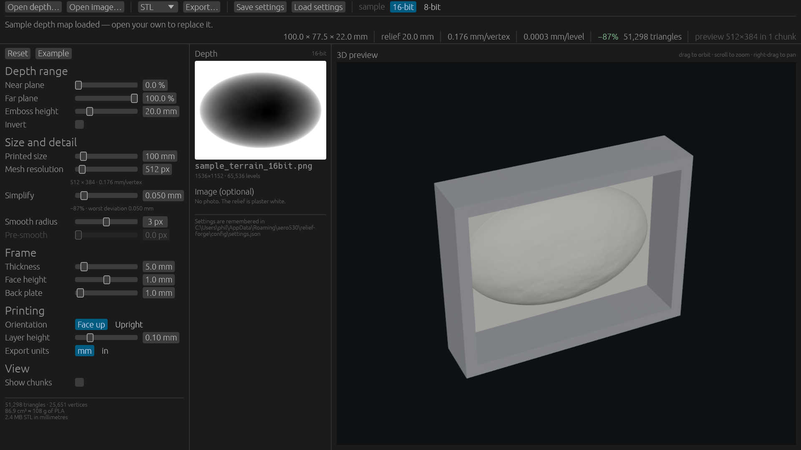

# Relief Forge

Turn a grayscale depth map into a watertight bas-relief you can print. Runs as a
desktop app and in the browser from the same source.

Feed it the 16-bit
gray PNG or an ordinary 8-bit gray JPEG.

**[Try it in the browser](https://aero530.github.io/relief-forge/)** — the same app, WebGL2, no
upload: the depth map never leaves your machine. Or install it:
**[Windows installer](https://github.com/aero530/relief-forge/releases/latest)** (per-user, no
administrator rights).



```
cargo run -p relief-app --release        # desktop
trunk serve                              # browser, at 127.0.0.1:8080
cargo run -p relief-cli -- --help        # headless
RELIEF_SHOT=shot.png cargo run -p relief-app   # render a few frames, save, exit
./installer/build.ps1                    # Windows MSI into target/installer
```


## How it is put together

```
relief-core   geometry. All the tests that matter.
  depth.rs      decode → invert → pre-smooth → median → normalise → window
  mesh.rs       Solid: a *view* over a height field, not a buffer
  decimate.rs   restricted quadtree: fewer triangles, to a stated tolerance
  tiles.rs      the preview, cut into GPU-sized chunks
  export/       STL, PLY, OBJ — streaming writers
  check.rs      closed? oriented? genus 0? what volume?
  stats.rs      the numbers the status bar shows
relief-app    bevy + egui shell: panels, off-screen 3D view, file IO, debounce
relief-cli    `relief convert|info|sample`
```

### Everything physical is millimetres

Upstream expresses relief depth and frame sizes as fractions of the model's
longest side, so "embossing 20" means nothing until you also know how big the
plaque is — and changing the depth silently changed the width, because the scale
came from the whole bounding box. Here they are millimetres, and the scale comes
from the plaque's *face*: **Printed size** is the longest outer side including the
frame, and **Emboss height** is how far the relief stands out of its plate. The
two are independent.

The only unitless controls left are the near and far planes, which window the
depth map's own range and are shown as percentages of it. **Export units** is a
separate idea: STL, OBJ and PLY store bare numbers with no unit field, so it
scales the coordinates written into the file — every readout on screen stays
metric.

**A frame of zero thickness is no frame.** Not a thin one: the rim and bezel stop
existing and the relief's sides drop straight to the back plate, so nothing
degenerate reaches the file and nothing draws a border the print does not have.

### Simplify is a distance, not a ratio

Most of a full-resolution relief's triangles describe nothing, so **Simplify** is
a tolerance in millimetres — the largest vertical deviation the surface may have
from the depth map — and a restricted quadtree keeps the fine grid only where the
surface moves. On the sample at 1024 px: 1,594,342 triangles down to 94,116, a
76 MB STL down to 3.9 MB, worst deviation exactly the 0.050 mm asked for.

A quadric edge collapse would do better per triangle and is the wrong tool here:
it needs the whole mesh plus adjacency in memory, which ends the streaming
export, and a *ratio* says nothing about whether the print will be right. The
border is simplified too and the frame is built on whatever survives, so the
skirt still shares its indices and the solid is still watertight by construction
— asserted across grid sizes, tolerances and both frame styles.

**A tolerance below the source's quantisation step buys nothing**, because every
step becomes a feature that has to be kept. An 8-bit map over 20 mm of relief
steps every 0.078 mm. Triangles surviving, from
`cargo run -p relief-core --example decimation_probe --release`:

| input | 0.02 mm | 0.05 mm | 0.10 mm | 0.20 mm |
|---|---|---|---|---|
| 16-bit, median 3 px | 5.2% | 3.4% | 2.8% | 2.5% |
| 8-bit + JPEG blocks | 98.7% | 83.8% | 59.3% | 24.5% |
| 8-bit + pre-smooth 1 px | 91.6% | 56.3% | 31.1% | 7.0% |
| 8-bit + pre-smooth 2 px | 52.5% | 23.7% | 8.2% | 2.2% |

So the app says which of the two is happening rather than just producing a
disappointing number — and **Pre-smooth** turns out to be a simplification
control as much as a quality one.

## Command line

```sh
relief sample -o depth.png                          # synthetic depth map to try
relief info depth.png --mm 120 --emboss 30          # what would this produce?
relief convert depth.png --thickness 0 --emboss 25  # no frame, 25 mm of relief
relief convert depth.png --tolerance 0              # keep every grid vertex
relief convert depth.png --format ply --photo face.jpg --check
relief convert depth.png --units in                 # coordinates written in inches
```

`--check` walks every edge and reports whether the result is watertight. It costs
memory proportional to the triangle count, which is why the app does not run it on
every rebuild — the app shows the streaming summary (volume, counts) instead.

Settings JSON is shared between the GUI and `--settings`.

## Limits, honestly

- **The slicer is the real ceiling.** 4096 px is 25 M triangles and a 1.26 GB STL.
  It exports, and PrusaSlicer will hate it. The app warns past 3 M.
- **Web is single-threaded.** No `rayon`, so the median filter at high resolution
  blocks the frame loop. Preview stays at 512 px to hide it; a big export will
  visibly pause.
- **WebGL2 only.** Bevy cannot pick a backend at runtime
  ([bevyengine/bevy#13168](https://github.com/bevyengine/bevy/issues/13168)), so
  one bundle has to choose, and WebGL2 is the one that runs in Firefox too.
- **The web bundle is large.** trunk 0.20.1 cannot drive a Binaryen that accepts
  current rustc output, so `wasm-opt` is disabled (see `Trunk.toml`). trunk 0.21 is
  out and would let it back on; until then the demo build carries a few extra MB.
- **Simplification is a quadtree, not a TIN.** Greedy Delaunay insertion
  (Garland–Heckbert's terrain paper) reaches the same tolerance in fewer
  triangles, at the cost of holding the output triangulation in memory. Worth
  revisiting only if the quadtree's counts become the complaint.
- **2.5D by definition.** One height per pixel: no undercuts, nothing hidden
  behind anything. That is what makes it a relief and not a model of the subject.

## Building and releasing

| | |
|---|---|
| `.github/workflows/ci.yml` | fmt, clippy at `-D warnings`, tests, and a wasm build, on every push |
| `.github/workflows/pages.yml` | builds the web demo and deploys it to GitHub Pages on every push to the default branch |
| `.github/workflows/installer.yml` | on a version tag: tests, builds the MSI, installs and uninstalls it to prove it works, then attaches it to the release |

`installer/build.ps1` provisions a pinned, checksummed WiX 3.14 into `target/` — nothing is
installed system-wide and no administrator rights are needed — then renders the licence page
from `LICENSE` and the wizard artwork from `resources/icon.png` so neither can drift from the
repository. The MSI installs per-user into `%LOCALAPPDATA%\Programs\Relief Forge`, puts the GUI
on the Start Menu and the folder on the user PATH, and removes all three on uninstall. Pass
`-CertThumbprint` to sign it; unsigned, Windows SmartScreen warns on first download.

`resources/icon.png` is a placeholder, generated by `resources/make-icon.py`.

For Pages to serve anything, the repository needs **Settings → Pages → Source: GitHub Actions**
set once.

## Licence

MIT. The upstream geometry it is derived from is Apache-2.0 — see `NOTICE`.
